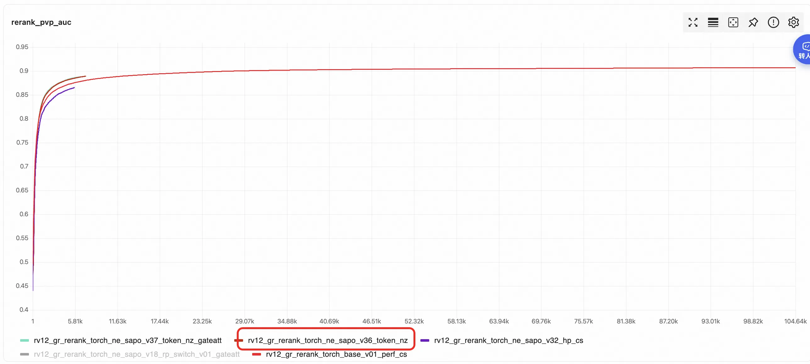

#### 2.2.1-01 理论部分
##### （1）背景与核心定义
电商排序场景的特征天然异构：包含离散ID（用户/商品ID、类目、品牌）、连续数值（价格、点击率、GMV）、时序行为序列（点击/加购/购买历史）、多模态预训练向量（文本相关性、图像特征）等，它们维度不同、结构不同、语义空间完全独立。

异构特征 Tokenization 是 Transformer 落地推荐排序的前置核心模块。其定义为：

将不同类型、不同维度、不同语义的异构特征，通过编码、投影、分组、序列化等方式，转换为统一维度、语义可区分、可直接输入 Transformer 的 Feature Token 序列，让注意力机制能够平等地对所有特征做细粒度交互建模。

##### （2）核心设计目标
+ 维度一致性：所有 Token 最终映射到同一隐层维度（hidden_dim），满足 Transformer 注意力计算的输入要求。
+ 语义保留性：保留原始特征的业务语义与区分度，避免归一化、投影操作导致的信息损失（尤其稀疏特征的能量梯度）。
+ 计算可控性：控制 Token 总数，将自注意力的二次复杂度约束在可接受的推理时延内。
+ 梯度完整性：保障稀疏 Embedding 的模长/能量梯度可反向传播，避免归一化层阉割 scale 学习信号。

##### （3）主流技术范式（对应电商排序场景）
**（3-01）离散特征：ID Embedding → 单 Token**

最基础的范式：每个离散特征字段（性别、类目、品牌）的 ID 值，通过 Embedding 查表得到向量，直接作为一个独立 Token。

+ 适用场景：低基数离散特征、稀疏 ID 特征
+ 局限：高基数特征 Embedding 参数量大；单特征对应一个 Token 会导致 Token 总数爆炸，算力不可控

**（3-02）连续特征：数值编码 → 投影 → Token**

主流有两种实现路线：

1. 分桶离散化：将价格、年龄等连续值按分位数/等宽分桶，转为离散 ID 后做 Embedding，和离散特征处理逻辑一致。

2. 直接线性投影：每个连续特征通过独立的线性层，直接映射到 hidden_dim 维度，作为一个 Token（FT-Transformer 的标准方案）。

+ 核心要点：尽量保留数值的大小关系，避免粗粒度分桶丢失细粒度区分度。

**（3-03）分组特征 Token（实验采用方法）**

+ 思路：按语义将特征划分为若干组（如商品属性组、用户属性组、交叉特征组、LLM向量组），同组内特征先拼接，再通过独立 MLP 投影为 1 个（或少量）Token。
+ 核心优势：

  1. 大幅压缩 Token 数量（从上百个特征压缩到 10 个以内），将注意力算力控制在可接受范围；

  2. 同语义特征在组内先做局部交互，减少跨语义噪声，提升注意力效率。

+ 代表工作：RankMixer、Group Transformer，以及你当前的精排架构。

**（3-04）序列特征：行为 Item → 序列 Token + 位置编码**

用户行为序列（点击、加购、购买）中，每个商品的 Embedding 直接作为序列中的一个 Token，叠加位置编码保留时序依赖关系。

+ 长序列优化：通过 Latent Query 交叉注意力（如你代码中的 Latent Fusion Encoder、HyFormer 的 Query Token），将长序列压缩为少量摘要 Token，解决序列长度爆炸的问题。
+ 代表工作：DIN、LONGER、HyFormer 序列分支。

##### （4）实验核心设计
+ 语义区分：增加 Token Type Embedding，区分不同特征组的语义空间，避免注意力计算时发生语义混淆。
+ 数量控制：通过分组压缩、长序列摘要化，将总 Token 数控制在 32-64 区间，平衡效果与推理时延。
+ 稀疏梯度保护：避免 Token 化后直接使用 LayerNorm，改用 RMSNorm、GroupEnergyNorm 等保留能量梯度的归一化方案（对应你之前优化的核心问题）。
+ 健康度监控：通过 tok_energy、tok_std、q_over_ns 等指标，监控 Token 的信号强度与分布，及时发现特征坍塌、能量拉平问题。

##### （5）参考论文
（1）RankMixer: Scaling Up Ranking Models in Industrial Recommenders

+ 发表方：字节跳动，arXiv 2025
+ 核心贡献：提出 Token-based 统一排序架构，用多头 Token Mixing 替代二次复杂度的自注意力，兼顾 Transformer 的高并行性与工业界的强时延约束，可支撑十亿级参数缩放。
+ 明确了「异构特征 → 语义分组 → 独立投影 → 统一 Token 序列」的工业界标准化流程；

（2）HyFormer: Revisiting the Roles of Sequence Modeling and Feature Interaction in CTR Prediction

+ 发表方：字节跳动，2026
+ 核心贡献：将长序列建模与多源特征交互集成在单一 Transformer 骨干中，通过 Query Generation → Query Decoding → Query Boosting 交替优化，解决传统「序列压缩+特征交叉」两阶段架构的信息瓶颈。

（3）OneTrans: Unified Feature Interaction and Sequence Modeling with One Transformer

+ 发表方：字节跳动，WWW 2026
+ 核心贡献：用单个 Transformer 骨干同时完成用户行为序列建模和特征交叉，用统一 Tokenizer 转换所有顺序/非顺序属性。

（4）HHFT: Hierarchical Heterogeneous Feature Transformer for Recommendation Systems

+ 发表方：阿里巴巴（淘宝天猫），arXiv 2025
+ 核心贡献：分层异构特征 Transformer，按语义划分特征块，使用块专属的 QKV 投影避免不同语义空间的特征混淆。
+ 提出「语义特征分区」思想，是分组 Token 化的进阶版本；验证了异构特征混洗会导致语义稀释，从理论上支撑了「分组独立编码」的设计合理性。

#### 2.2.1-02 实验部分

       在Transformer的基座排序模型上，所有特征都Tokenization到256维度，最后的AUC在6k步，训练AUC就会有明显提升，提升从0.876-->0.886，提升了1.0pt+。 

